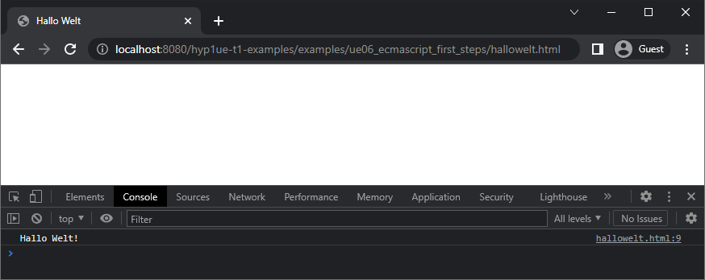
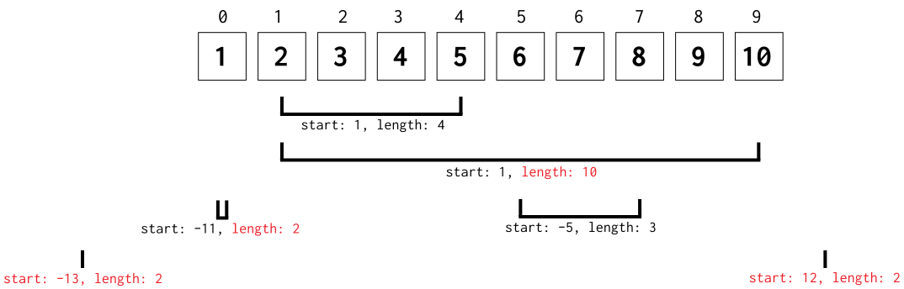

# Übung 1 JavaScript Teil 1: ECMAScript-Grundlagen

Die erste Übung zum Thema JavaScript ist rein der Arbeit mit ECMAScript vorbehalten. Es sollen die Sprache kennengelernt, mit Variablen, Arrays und Funktionen gearbeitet und Konzepte wie die lose Typbindung erprobt werden.

## Vorbereitungen

In der heutigen Übung wird ECMAScript rein algorithmisch eingesetzt, d.h. es werden noch keine Webseiten-Inhalte manipuliert, sondern nur die Sprache an sich erprobt. Zur Ausgabe wird die Konsole in den Developer-Tools der Browser herangezogen. Um JavaScript ausführen zu können, ist für jedes der drei nachfolgenden Beispiele bereits eine HTML-Datei mit diesem Markup enthalten.

```html
<!DOCTYPE html>
<html lang="en">
<head>
  <meta charset="UTF-8">
  <title>Template for JavaScript</title>
</head>
<body>
<script>

</script>
</body>
</html>
```

Jeglicher JavaScript-Code muss zwischen `<script>` und `</script>` geschrieben werden.

Um eine Ausgabe in der Konsole zu erzeugen, verwenden Sie `console.log();`. Sie können darin Zeichenketten, Zahlen, Variablen oder auch Arrays angeben. Diese werden in der Konsole ausgegeben (diese wie gewohnt, z.B. durch <kbd>F12</kbd> öffnen). Diese Abbildung zeigt die beispielhafte Ausgabe von `console.log("Hallo Welt!");`.

|  |
|:---------------------------------------------------------------------------------------------------------------------------------------------------------:|
|                     **Ausgabe in der Konsole von 'Hallo Welt'. Die Seite selbst bleibt leer, da keinerlei HTML-Output erzeugt wird.**                     |

## Variablen und loses Typkonzept

Editieren Sie die HTML-Datei `variables.html` und testen Sie innerhalb des `<script>`-Elements ab, wie sich Variablen unterschiedlichen Typs in JavaScript bei diversen Operationen verhalten. Legen Sie zunächst vier Variablen an:

- eine Variable, die eine Ganzzahl enthält (z.B. `number`),
- eine Variable, die eine Ganzzahl als Zeichenkette (Zahl in einem String) enthält (z.B. `stringNumber`),
- eine Variable, die eine Zeichenkette mit Text (Buchstaben) enthält (z.B. `string`) und
- eine Variable, die ein Array mit drei String-Werten enthält (z.B. `array`).

Führen Sie nun die folgenden sechs Operationen aus und geben Sie das Ergebnis jeweils mit `console.log()` aus:

- [ ] Addieren Sie `number` und `stringNumber`.
- [ ] Multiplizieren Sie `number` und `stringNumber`.
- [ ] Addieren Sie `number` und `string`.
- [ ] Multiplizieren Sie `number` und `string`. 
- [ ] Addieren Sie `number` und `array`.
- [ ] Multiplizieren Sie `number` und `array`.

Versuchen Sie anhand der Ergebnisse nachzuvollziehen, wie sich das lose Typkonzept von JavaScript hier auswirkt.

Welchen Datentyp hat das jeweilige Ergebnis? Geben Sie diesen mithilfe des [`typeof`](https://developer.mozilla.org/en-US/docs/Web/JavaScript/Reference/Operators/typeof)-Operators ebenfalls mit `console.log()` aus.

Ihnen ist etwas nicht klar? Diskutieren Sie in einem GitHub Issue oder auf Microsoft Teams!

## Funktionen und Kontrollstrukturen zur Temperaturumwandlung

Editieren Sie die Datei `convert.html` und schreiben Sie darin eine Funktion, die Temperaturen zwischen den drei bekannten Einheiten Celsius, Fahrenheit und Kelvin umwandeln kann. Die Signatur der Funktion soll dabei wie folgt aussehen:

```javascript
function convertTemperature(temperature, fromUnit, toUnit) {
	
}
```

Die Parameter haben folgende Bedeutung:

- `temperature`: Die Temperatur, die umgewandelt werden soll (z.B. 35). Erwartet eine beliebige Zahl.
- `fromUnit`: Die Quell-Einheit, in der die Temperatur vorliegt. Erwartet die Einheit als Zeichenkette, d.h. entweder `"celsius"`, `"fahrenheit"` oder `"kelvin"`.
- `toUnit`: Die Ziel-Einheit, in welche die Temperatur umgewandelt werden soll. Erwartet die Einheit als Zeichenkette, d.h. entweder `"celsius"`, `"fahrenheit"` oder `"kelvin"`.

Implementieren Sie die Funktion, sodass Umwandlungen von jeder Einheit in jede Einheit möglich sind und mittels `return` zurückgegeben werden. Auch wenn Quell- und Ziel-Einheit dieselbe sind, soll ein sinnvolles Ergebnis (nämlich die unveränderte Temperatur) ausgegeben werden. Werden für Parameter 2 und 3 andere Werte, als die drei Einheiten angegeben, so soll eine Fehlermeldung zurückgegeben werden (z.B. "Invalid argument: degrees"). Sie müssen nicht alles in dieser einen Funktion berechnen, es ist auch möglich, weitere Funktionen zu definieren, die dann von `convertTemperature()` aus aufgerufen werden.

Testen Sie mit diesen zwölf Fällen und geben Sie diese mit `console.log()` aus (die korrekten Ergebnisse sind zur Kontrolle als Kommentare angefügt):

- [ ] `convertTemperature(35, "celsius", "fahrenheit") // 95`
- [ ] `convertTemperature(35, "celsius", "kelvin") // 308.15`
- [ ] `convertTemperature(35, "celsius", "celsius") // 35`
- [ ] `convertTemperature(35, "kelvin", "fahrenheit") // -396.67`
- [ ] `convertTemperature(35, "kelvin", "kelvin") // 35`
- [ ] `convertTemperature(35, "kelvin", "celsius") // -238.14999999999998`
- [ ] `convertTemperature(35, "fahrenheit", "fahrenheit") // 35`
- [ ] `convertTemperature(35, "fahrenheit", "kelvin") // 274.81666666666666`
- [ ] `convertTemperature(35, "fahrenheit", "celsius") // 1.6666666666666667`
- [ ] `convertTemperature(35, "degrees", "degrees") // Invalid argument: degrees`
- [ ] `convertTemperature(35, "celsius", "degrees") // Invalid argument: degrees`
- [ ] `convertTemperature(35, "degrees", "fahrenheit") // Invalid argument: degrees`

Die ersten 9 repräsentieren jeweils die verschiedenen Umwandlungspfade, bei den letzten drei Aufrufen ist jeweils mindestens ein ungültiges Argument (`"degrees"`) angegeben. Dies soll eine Fehlermeldung erzeugen.

## Funktion zur Array-Extraktion

Editieren Sie die Datei `arrayextract.html` und schreiben Sie darin eine Funktion, die aus einem Array ein beliebiges Teilstück entnimmt und als neues Array mit `return` zurückgibt. Die Signatur der Funktion soll wie folgt aussehen:

```javascript
function arrayExtract(array, start, length) {
	
}
```

Die Parameter haben folgende Bedeutung:

- `array`: Das Array, aus dem ein Teil entnommen werden soll. Erwartet ein Array.
- `start`: Die Indexposition in `array`, von der die Entnahme begonnen werden soll. Erwartet eine Ganzzahl.
- `length`: Die Anzahl an Elementen, die ab der Indexposition entnommen werden sollen. Erwartet eine Ganzzahl.

Definieren Sie das folgende Array, aus dem Sie anschließend Teile entnehmen:

```javascript
const exampleArray = [1, 2, 3, 4, 5, 6, 7, 8, 9, 10];
```

Für das Entnehmen gelten drei Regeln, die Abbildung stellt dies bildlich dar:

|  |
|:---------------------------------------------------------------------------------------------------------------------------------:|
|                      **Das Beispielarray und die Auswirkungen der verschiedenen Start- und Längenangaben.**                       |

- Ist der Wert für `start` negativ, so wird von hinten zu zählen begonnen. Hat ein Array die Länge 10, so ist ein Startwert von −1 das letzte Element, −2 das vorletzte usw.
- Sind Startwert und/oder Länge so gewählt, dass sie über das Array hinausragen, so darf das entstehende Array nur gültige Werte enthalten. Es darf also kein `undefined` vorkommen. Es werden dann einfach dementsprechend weniger Elemente zurückgegeben. Werden die Werte so gewählt, dass es gar keine Überschneidung gibt, so soll ein leeres Array zurückgegeben werden.
- Die Funktion muss auch mit zwei, einem oder keinem Parameter funktionieren (d.h. darf beim Aufruf keinen Fehler anzeigen). In diesen Fällen soll sie einfach ein leeres Array zurückgeben.

Implementieren Sie nun die obigen Regeln und testen Sie mit den folgenden 9 Fällen. Zeigen Sie das jeweilige Ergebnis mit `console.log()` an (die Kommentare enthalten das korrekte Ergebnis zur Kontrolle):

- [ ] `arrayExtract(exampleArray, 1, 4) // [2, 3, 4, 5]`
- [ ] `arrayExtract(exampleArray, 1, 10) // [2, 3, 4, 5, 6, 7, 8, 9, 10]`
- [ ] `arrayExtract(exampleArray, 12, 2) // []`
- [ ] `arrayExtract(exampleArray, -5, 3) // [6, 7, 8]`
- [ ] `arrayExtract(exampleArray, -11, 2) // [1]`
- [ ] `arrayExtract(exampleArray, -13, 2) // []`
- [ ] `arrayExtract() // []`
- [ ] `arrayExtract(exampleArray) // []`
- [ ] `arrayExtract(exampleArray, 0) // []`

## Tipps und Richtlinien

- Arbeiten Sie nur mit den einfachen ECMAScript-Mitteln, die Sie in der Vorlesung kennengelernt haben. Auch, wenn Sie bereits JavaScript beherrschen.
- Bei Fragen oder Problemen zur Aufgabe verwenden Sie den Pull Request "Feedback" oder eröffnen Sie Issues. Alternativ können Sie Fragen auch in Microsoft Teams stellen.
- Zum Üben: https://www.jshero.net/
